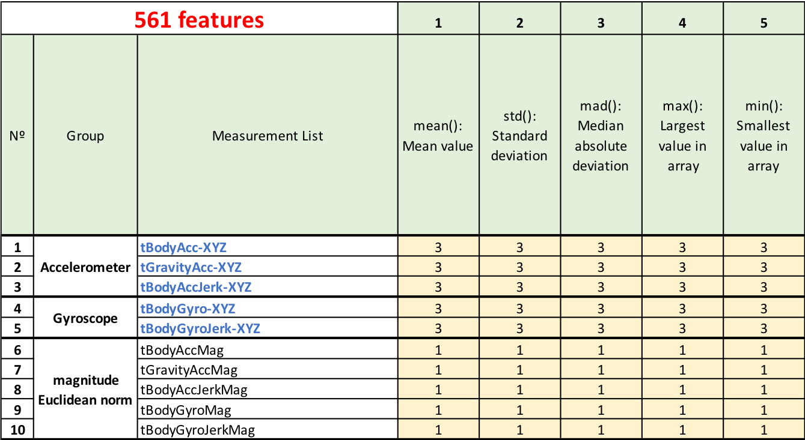
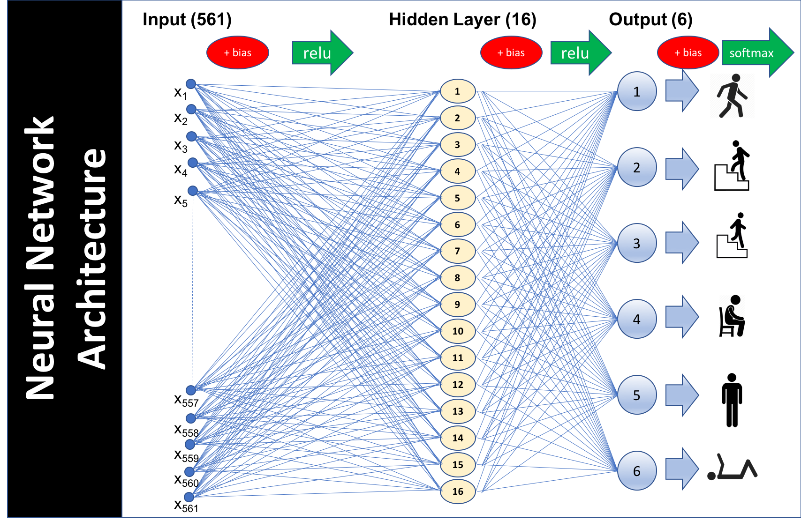
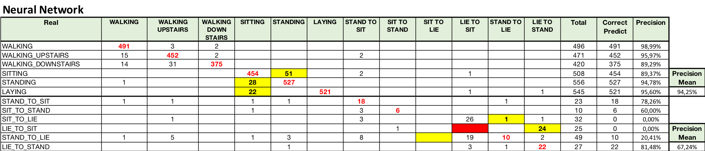

# Human Activity Recognition Using Smartphones

## Abstract:

Human Activity Recognition database built from the recordings of 30 subjects performing activities of daily living (ADL) while carrying a waist-mounted smartphone with embedded inertial sensors.

Source:
(http://archive.ics.uci.edu/ml/datasets/Human+Activity+Recognition+Using+Smartphones)
Video of Experiment:
https://www.youtube.com/watch?v=XOEN9W05_4A

## How the data were collected?

The experiments have been carried out with a group of 30 volunteers within an age bracket of 19-48 years. Each person performed six activities (WALKING, WALKING UPSTAIRS, WALKING DOWNSTAIRS, SITTING, STANDING, LAYING) wearing a smartphone (Samsung Galaxy S II) on the waist. Using its embedded accelerometer and gyroscope, we captured 3-axial linear acceleration and 3-axial angular velocity at a constant rate of 50Hz.

The sensor signals (accelerometer and gyroscope) were pre-processed by applying noise filters and then sampled in fixed-width sliding windows of 2.56 sec and 50% overlap (128 readings/window)

## Who was responsible for collecting the data?

## Train / Test dataset:

## Question:

Is it possible to develop a statistical model that can predict with good accuracy the activity developed by the person based on the information provided by the sensors?

## Features:

The features selected for this database come from the accelerometer and gyroscope 3-axial raw signals tAcc-XYZ and tGyro-XYZ. These time domain signals (prefix 't' to denote time) were captured at a constant rate of 50 Hz. Then they were filtered using a median filter and a 3rd order low pass Butterworth filter with a corner frequency of 20 Hz to remove noise. Similarly, the acceleration signal was then separated into body and gravity acceleration signals (tBodyAcc-XYZ and tGravityAcc-XYZ) using another low pass Butterworth filter with a corner frequency of 0.3 Hz.

Subsequently, the body linear acceleration and angular velocity were derived in time to obtain Jerk signals (tBodyAccJerk-XYZ and tBodyGyroJerk-XYZ). Also the magnitude of these three-dimensional signals were calculated using the Euclidean norm (tBodyAccMag, tGravityAccMag, tBodyAccJerkMag, tBodyGyroMag, tBodyGyroJerkMag).

For a brief evaluation of the data, it follows a comparison of how some features behave in face of the different types of activities performed:

### Accelerometer Body

#### Mean:

#### Standard Deviation:

### Accelerometer Gravity

#### Mean:

#### Standard Deviation:

### Gyroscope Body

#### Mean:

#### Standard Deviation:

### Angle Gravity

## Correlation between features

As predicted with 561 features, many are overly correlated

### Accelerometer Body:

### Accelerometer Gravity:

### Gyroscope Body:

## Reducing dimensionality

I used the PCA method to reduce the dimensionality of the sample to 36 components being possible to represent more than 90% of the variance.

### PCA variance ratio:

## Comparing Accuracy Models

### Decision Tree (Worst Accuracy):

#### Confusion Matrix:

### Neural Network (Best Accuracy):

#### Architecture:

#### Plot TensorBoard Validation Accuracy:

#### Plot TensorBoard Validation Loss:

#### Confusion Matrix:

## Updated version Dataset:

An updated version of this data set was published in 2015 and includes labels for postural transitions between activities, as shown in the table below:
http://archive.ics.uci.edu/ml/datasets/Smartphone-Based+Recognition+of+Human+Activities+and+Postural+Transitions

As can be observed, 6 new transient activities were included, but with a reduced number of samples. The new 6 activities account for only about 5% of total samples.

Applying the same models (without significant changes) to the new database there was no significant change in the accuracy obtained with exception for the AdaBoost model that had a greater reduction.

Although there was no significant reduction in overall accuracy, transient activities performed poorly on the models. Below I present the confusion matrix for the neural network where for the transient activities we had an average precision of 67.24% against the 94.25% obtained for the 6 initial activities.

Note that the model was not able to predict any LIE_TO_SIT activity, predicting this activity in general as LIE_TO_STAND. We can imagine that the LIE_TO_STAND activity starts in a similar way to the LIE_TO_SIT activity which may have contributed to the forecast error.

## Conclusion:

- The identification of 6 firts activities through the analysis of the measurements generated by the cell phone is possible with a good precision;

- On the other hand it was not possible to identify in a similarly precise way the transient activities, reaching smaller indices of precision.

- The neural network presented better results than other classification models

  OBS: The Support Vector  Machine (SVM), working with all predictors (561), without using PCA, presented superior accuracy to neural network);

- The use of this methodology can allow the creation of applications that identify the type of activity developed by the user while carrying his cell phone next to the body.
