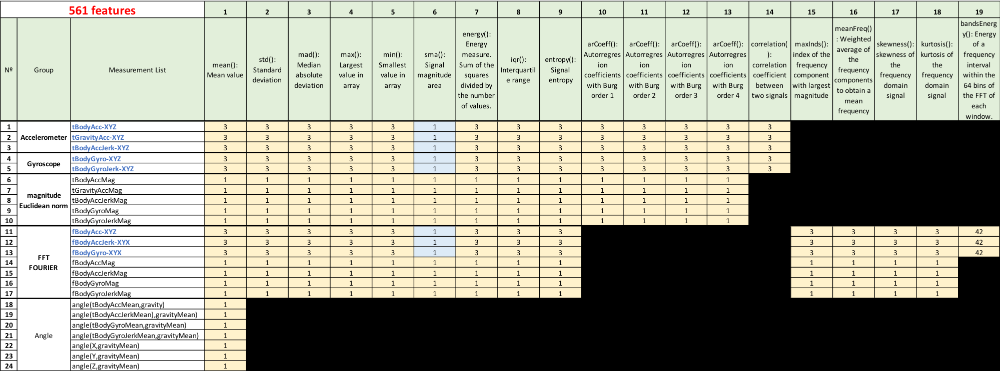
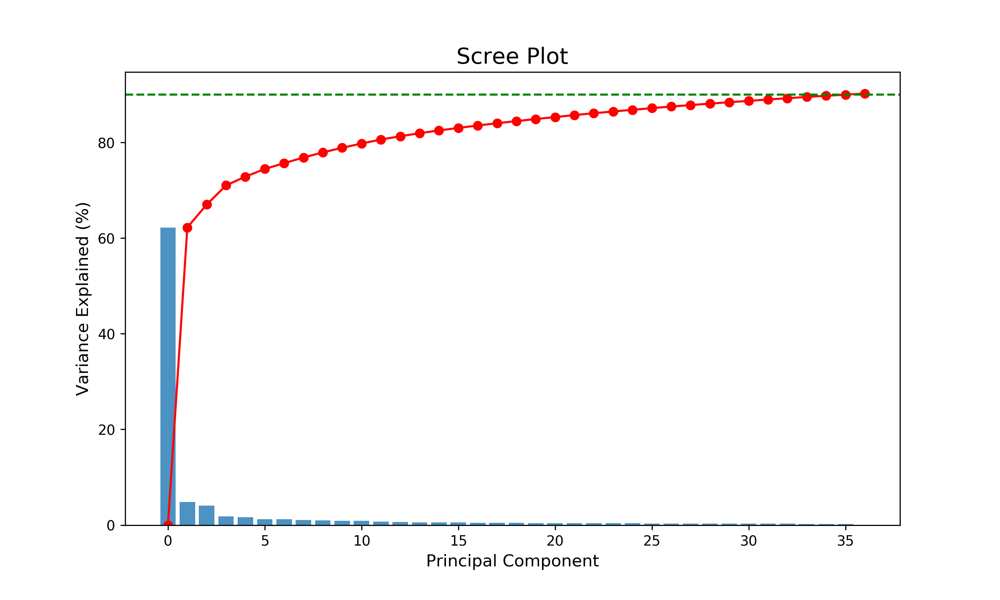
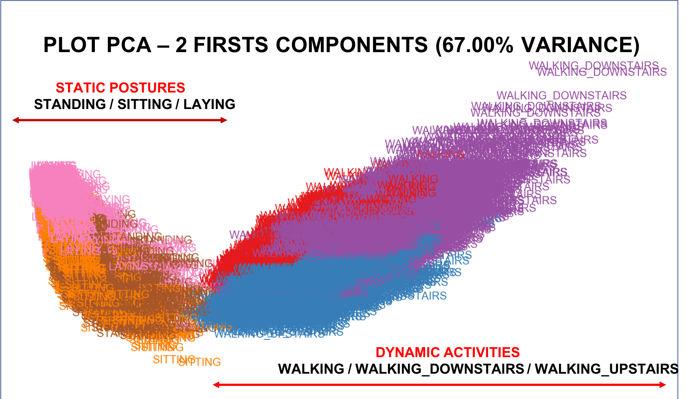
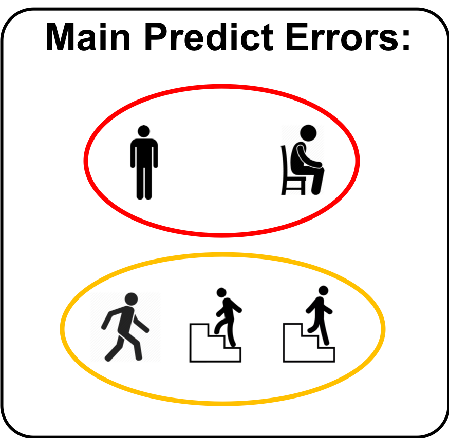

# Human Activity Recognition Using Smartphones

## Abstract:

Human Activity Recognition database built from the recordings of 30 subjects performing activities of daily living (ADL) while carrying a waist-mounted smartphone with embedded inertial sensors.

Source:
(http://archive.ics.uci.edu/ml/datasets/Human+Activity+Recognition+Using+Smartphones)

Video of Experiment:
https://www.youtube.com/watch?v=XOEN9W05_4A

## How the data were collected?

The experiments have been carried out with a group of 30 volunteers within an age bracket of 19-48 years. Each person performed six activities (WALKING, WALKING UPSTAIRS, WALKING DOWNSTAIRS, SITTING, STANDING, LAYING) wearing a smartphone (Samsung Galaxy S II) on the waist. Using its embedded accelerometer and gyroscope, we captured 3-axial linear acceleration and 3-axial angular velocity at a constant rate of 50Hz.

The sensor signals (accelerometer and gyroscope) were pre-processed by applying noise filters and then sampled in fixed-width sliding windows of 2.56 sec and 50% overlap (128 readings/window)

## Who was responsible for collecting the data?

## Train / Test dataset:

## Question:

Is it possible to develop a statistical model that can predict with good accuracy the activity developed by the person based on the information provided by the sensors?

## Features:

The features selected for this database come from the accelerometer and gyroscope 3-axial raw signals tAcc-XYZ and tGyro-XYZ. These time domain signals (prefix 't' to denote time) were captured at a constant rate of 50 Hz. Then they were filtered using a median filter and a 3rd order low pass Butterworth filter with a corner frequency of 20 Hz to remove noise. Similarly, the acceleration signal was then separated into body and gravity acceleration signals (tBodyAcc-XYZ and tGravityAcc-XYZ) using another low pass Butterworth filter with a corner frequency of 0.3 Hz.

## Correlation between features

As predicted with 561 features, many are overly correlated

### Accelerometer Body:

### Accelerometer Gravity:

### Gyroscope Body:

## Reducing dimensionality

I used the PCA method to reduce the dimensionality of the sample to 36 components being possible to represent more than 90% of the variance.

### PCA variance ratio:

We can see that the first 2 components of the PCA (67% variance) already allow us a good separation between STATIC POSTURES and DYNAMIC ACTIVITIES:

## Comparing Accuracy Models

### Neural Network (Best Accuracy):

#### Architecture:

#### Main Predict Errors:

## Conclusion:

- The identification of activities through the analysis of the measurements generated by the cell phone is possible with a good accuracy;

- The neural network presented better results than other classification models
